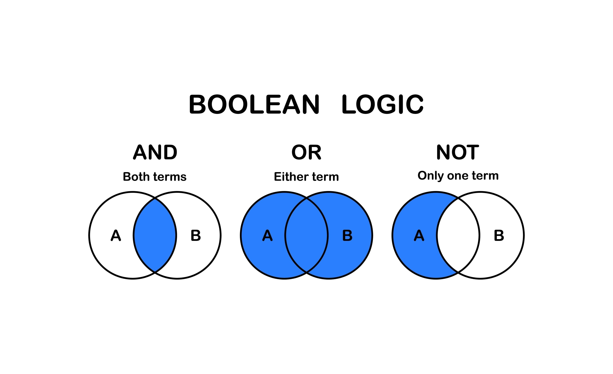
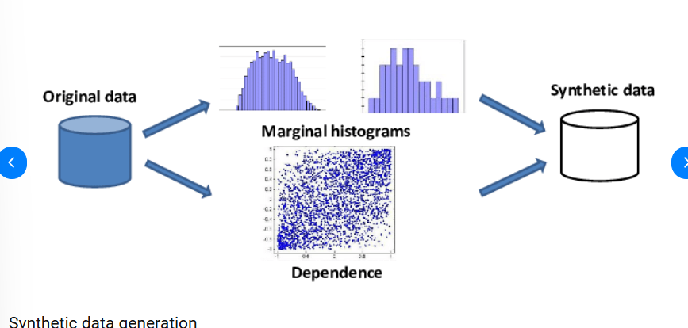

# Exercise 2 - querying multiple tables
**Actual sql queries in their corresponding folder.

### TASK 0: Cleaning malformed text data 
Find the sql files in video_code_along/09_temporal_data

### TASK 1: More extensive EDA on the sakila database
Find the sql files in video_code_along/11_set_operations


## Theory questions

These study questions are good to get an overview of how SQL and relational databases work.

### a) What is the difference between INNER JOIN and INTERSECT?
Both of these find "matches," but they do it in very different ways.

| Concept        | Analogy                                                                                   |
| -------------- | ----------------------------------------------------------------------------------------- |
| **INNER JOIN** | Taking two lists (names + phone numbers) and taping them side-by-side to make a phonebook |
| **INTERSECT**  | Comparing a wedding guest list and a birthday guest list to see who appears on both       |



#### `INNER JOIN` (Horizontal): 
This connects two tables based on a common column (like an ID). It stitches columns from Table A to columns from Table B.

**Result:** The rows get wider because you are adding columns.

**Requirement:** Tables can have completely different structures, as long as they have one matching **"key"** column.

```sql
Table A            INNER JOIN          Table B
(id, name)        -------------->      (id, salary)

Result:
(id, name, salary)
```

#### `INTERSECT` (Vertical):
This compares two completely separate lists (results) and returns only the rows that are identical in both.

**Result:** The list gets shorter (filtering).

**Requirement:** Both results must have the exact same structure (same number of columns and data types).

```sql
Result A: [1,2,3,4]
Result B: [3,4,5,6]

A INTERSECT B → [3,4]
```

### b) When are the purposes of set operations?

| Operation   | Purpose                                |
| ----------- | -------------------------------------- |
| `UNION`     | Combine lists and remove duplicates    |
| `UNION ALL` | Combine lists and keep duplicates      |
| `INTERSECT` | Return only rows found in both results |
| `EXCEPT`    | Subtract rows (A minus B)              |


### c) What are the main difference between joins and set operations?

| **Feature**     | **Joins (INNER, LEFT, etc.)**                                             | **Set Operations (UNION, INTERSECT)**                                      |
|-----------------|---------------------------------------------------------------------------|----------------------------------------------------------------------------|
| **Direction**   | Horizontal. Combines columns side-by-side.                                | Vertical. Stacks rows on top of each other.                                |
| **Data Source** | Relates data between different entities (e.g., Customers and Orders).      | Combines data from similar entities (e.g., Customers_US and Customers_EU). |
| **Columns**     | Can select columns from both tables X and Y.                              | The columns must be the same number and type in both queries.             |


### d) When is set operators used contra logical operators?

#### Logical Operators (`AND`, `OR`)

**Where:** Used inside the `WHERE` clause of a single query.

**Use case**: You are filtering rows based on specific column values.

**Example**: "Show me customers who are from the USA AND are over 30."

```sql
SELECT *
FROM customers
WHERE country = 'Sweden'
  AND age > 30;
```

#### Set Operators (`UNION`, `INTERSECT`)

**Where**: Used to connect two separate queries.

**Use case**: You are combining whole result sets.

**Example**: "Give me a list of customers from the USA table. Now, combine that (UNION) with the list from the Canada table."
```sql
SELECT name FROM customers_sweden
UNION
SELECT name FROM customers_norway;
```

#### 1. Everything in A and B ($A \cup B$)
Use `UNION` (removes duplicates) or `UNION ALL` (keeps duplicates).
```sql
SELECT column_name FROM A
UNION
SELECT column_name FROM B;
```

```sql
A:
1
2
3

B:
3
4
5

A UNION B:
1
2
3
4
5
```

#### 2. Only the overlap between A and B ($A \cap B$)
Use ``INTERSECT. This returns rows found in both A and B.
```sql
SELECT column_name FROM A
INTERSECT
SELECT column_name FROM B;
```

```sql
A: 1 2 3 4
B:   2 3   5

A INTERSECT B:
2 3
```

#### 3. A without B ($A - B$)
Use `EXCEPT``. This returns rows in A that strictly do not exist in B.
```sql
SELECT column_name FROM A
EXCEPT
SELECT column_name FROM B;
```

```sql
A: 1 2 3 4
B:   2 3

A EXCEPT B:
1 4
```
### e) How to achieve this using set operations in SQL, where A and B are result sets.


```sql
SELECT * FROM A
EXCEPT
SELECT * FROM B;
```
**Step-by-Step Logic**
- Start with A: The database grabs all rows from result set A.

- Look at B: It looks at result set B to see which rows match.

- Subtract: It removes the matching rows from the A list.

- Result: You are left only with rows that are unique to A.

### f) How to achieve this using set operations in SQL, where A and B are result sets.


```sql
/* Part 1: Unique to A (Left side) */
SELECT * FROM A
EXCEPT
SELECT * FROM B

UNION ALL

/* Part 2: Unique to B (Right side) */
SELECT * FROM B
EXCEPT
SELECT * FROM A;`
```
**Breakdown of the Logic**
- Top Block (A EXCEPT B): This grabs the white crescent on the left (Items in A, but not B).

- Bottom Block (B EXCEPT A): This grabs the white crescent on the right (Items in B, but not A).

- `UNION ALL`: This stitches the two results together into one final list.

### g) Does joining order matter for three or more tables?

## Glossary

| terminology        | explanation                                                                                                                                                                                                                                                              |
| ------------------ | ------------------------------------------------------------------------------------------------------------------------------------------------------------------------------------------------------------------------------------------------------------------------ |
| **temporal**       | Refers to *time-based data*, such as dates, timestamps, intervals, durations. Temporal queries answer questions like “What trains departed last Monday?” or “What is the delay difference between scheduled and actual time?”                                            |
| **interval**       | A *time duration* (e.g., “2 hours”, “3 days”). Often used for calculations.<br><br>Example:<br>`sql\nSELECT NOW() + INTERVAL '2 hours';`                                                                                                                                 |
| **synthetic**      | Data that is *artificially generated* instead of collected from the real world. Used for testing, training, teaching.                                                                                                                                                    |
| **VALUES**         | A SQL constructor used to create *inline rows* without a table.<br><br>Example:<br>`sql\nSELECT * FROM (VALUES (1, 'A'), (2, 'B')) AS t(id, label);`                                                                                                                     |
| **subquery**       | A query *inside* another query. It acts like a temporary table.<br><br>Example:<br>`sql\nSELECT * FROM (SELECT * FROM trains WHERE delay_minutes > 10);`                                                                                                                 |
| **compound query** | A query made by *combining multiple SELECTs* using set operations such as `UNION`, `INTERSECT`, or `EXCEPT`.                                                                                                                                                             |
| **set operations** | Operations that treat results like mathematical sets. They compare *whole rows* between SELECT statements.<br><br>**Includes:**<br>- `UNION`<br>- `UNION ALL`<br>- `INTERSECT`<br>- `EXCEPT`<br><br>Visual:<br>`\nA ∪ B  (UNION)\nA ∩ B  (INTERSECT)\nA - B  (EXCEPT)\n` |
| **EXCEPT**         | Returns rows that exist in **A** but not in **B**.<br><br>Venn diagram style:<br>`\n A: ●●●●●\n B:   ●●\n A EXCEPT B = only the left circle\n`                                                                                                                           |
| **result set**     | The output table that a SQL query returns.                                                                                                                                                                                                                               |
| **UNION**          | Combines two result sets and **removes duplicates**.<br><br>`\n A = {1,2,3}\n B = {3,4}\n A UNION B = {1,2,3,4}\n`                                                                                                                                                       |
| **UNION ALL**      | Combines two result sets and **keeps duplicates**.<br><br>`\n A = {1,2,3}\n B = {3,4}\n A UNION ALL B = {1,2,3,3,4}\n`                                                                                                                                                   |
| **operator**       | A symbol/keyword that performs an action, such as `+`, `=` , `LIKE`, `UNION`.                                                                                                                                                                                            |
| **INTERSECT**      | Returns only rows that exist *in both sets*. <br><br>Diagram:<br>`\n A ∩ B  (overlapping part)\n`                                                                                                                                                                        |
| **venn diagram**   | A visual tool to show relationships between sets (like A ∪ B, A ∩ B). Often used to explain set operations.                                                                                                                                                              |
| **LEFT JOIN**      | Returns **all rows from the left table**, and matching rows from the right. Missing matches become NULL.<br><br>Diagram:<br>`\nLEFT: ●●●●●\nRIGHT:   ●●\nResult: keep all from LEFT\n`                                                                                   |
| **INNER JOIN**     | Returns only rows that match in *both* tables.<br><br>Diagram:<br>`\nA ●●●\nB   ●●●\noverlap = INNER JOIN\n`                                                                                                                                                             |
| **RIGHT JOIN**     | Opposite of LEFT JOIN: keep all rows from the right table and matching rows from the left.                                                                                                                                                                               |
| **LIKE**           | A simple pattern-matching operator.<br><br>Examples:<br>`sql\nWHERE city LIKE 'Stock%'\nWHERE name LIKE '%son'\n`                                                                                                                                                        |
| **ILIKE**          | Case-insensitive version of LIKE.<br><br>`sql\nWHERE city ILIKE 'stock%'\n`                                                                                                                                                                                              |
| **regexp**         | Pattern matching using *regular expressions*, more powerful than LIKE.<br><br>`sql\nWHERE email ~ '^[a-z]+@[a-z]+\\.com$'\n`                                                                                                                                             |

## JOINS
```sql
INNER JOIN     → overlap only
LEFT JOIN      → everything from LEFT + matches
RIGHT JOIN     → everything from RIGHT + matches
FULL JOIN      → all rows from both sides (DuckDB supports it)
```

## Set Operations
```sql
UNION          → combine sets, remove duplicates
UNION ALL      → combine sets, keep duplicates
INTERSECT      → intersection (overlap)
EXCEPT         → rows in A but not in B
```

```css
A ∪ B   → UNION
A ∩ B   → INTERSECT
A - B   → EXCEPT
```

## JOINS


## String Matching
```sql
LIKE           → basic patterns
ILIKE          → case-insensitive
regexp (~)     → advanced patterns
```

## Interval
```sql
SELECT NOW() + INTERVAL '3 days';
```

## Synthetic

[What is Synthetic Data Generation? (K2View)](https://www.k2view.com/what-is-synthetic-data-generation/)

## Values
A SQL constructor for creating inline rows.
```sql
SELECT * FROM (VALUES (1, 'A'), (2, 'B')) AS t(id, label);
```

## Subquery
A query inside another query.
Used like a temporary table.
```sql
Main Query
└── Subquery
    └── Data
```

## Compound Query
A query built using set operators like:
UNION, UNION ALL, INTERSECT, EXCEPT
They allow combining whole result sets.

## LIKE
Basic pattern matching.
```sql
WHERE name LIKE 'Stock%'
```

## ILIKE
Case-insensitive LIKE.
```sql
WHERE name LIKE 'Stock%'
```

## regex
Regular expression matching for extremely flexible patterns.
```sql
WHERE email ~ '^[a-z]+@[a-z]+\\.com$'
```